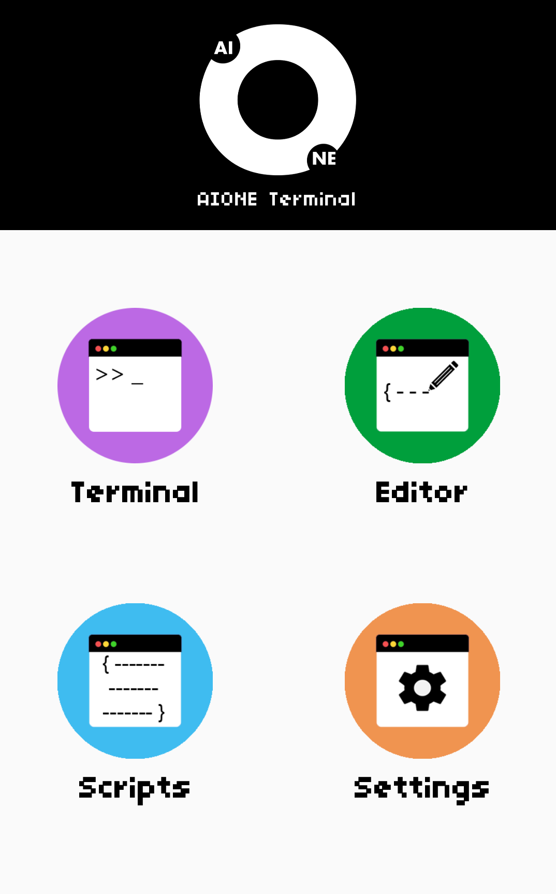
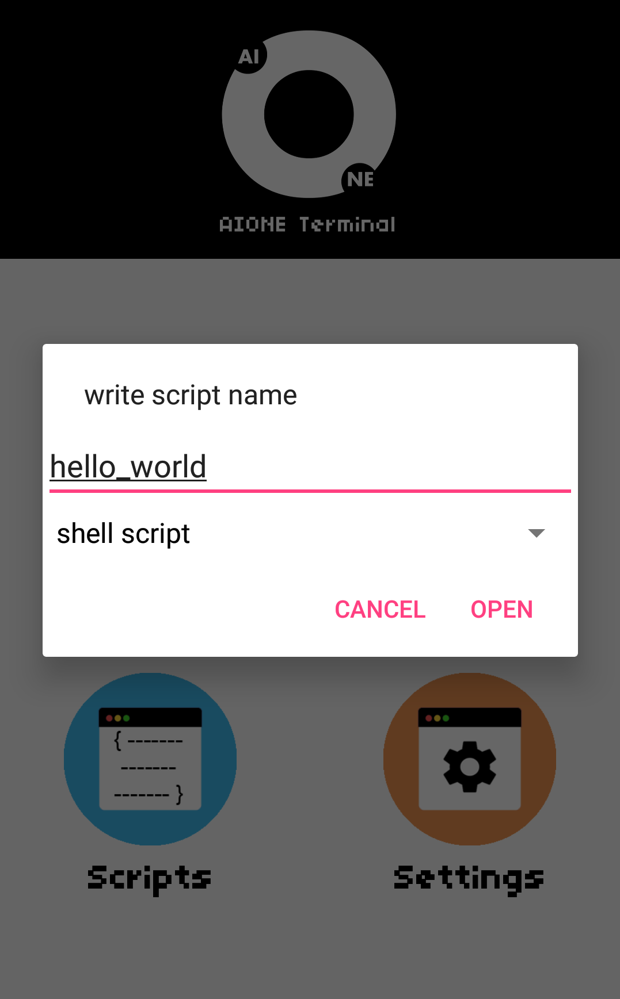
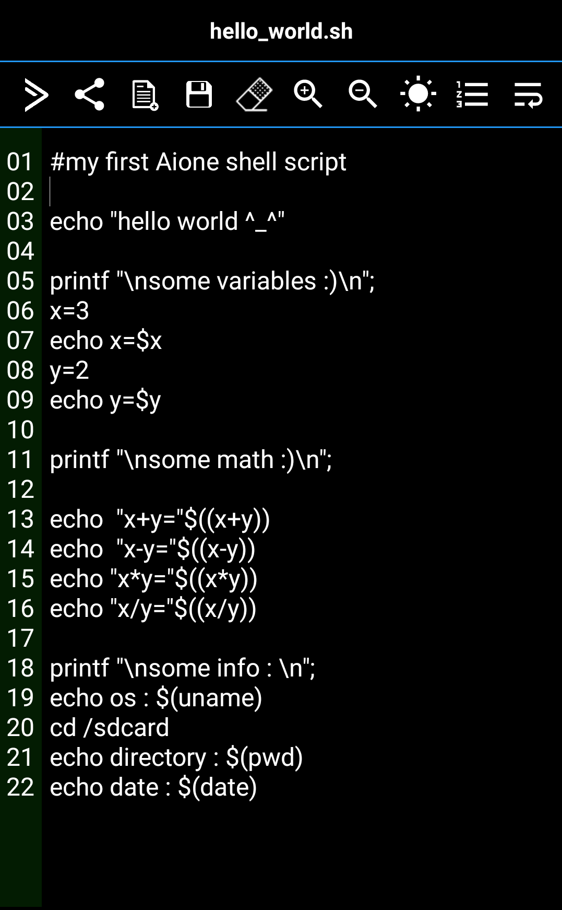
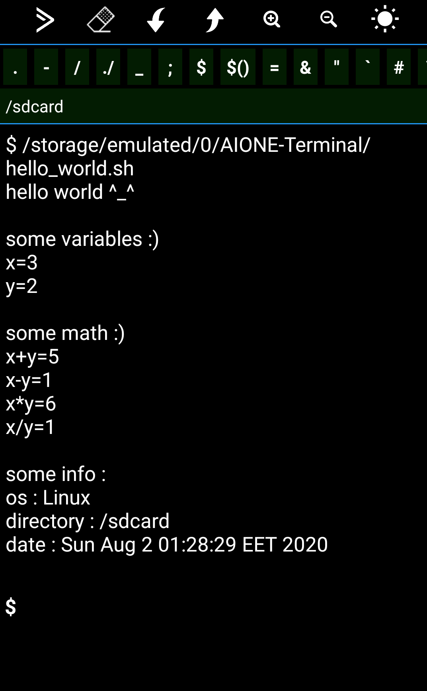
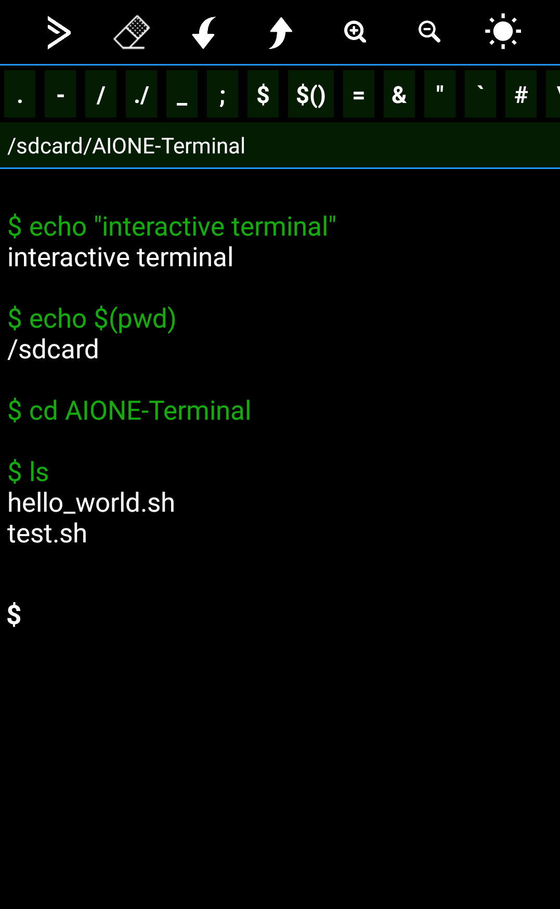
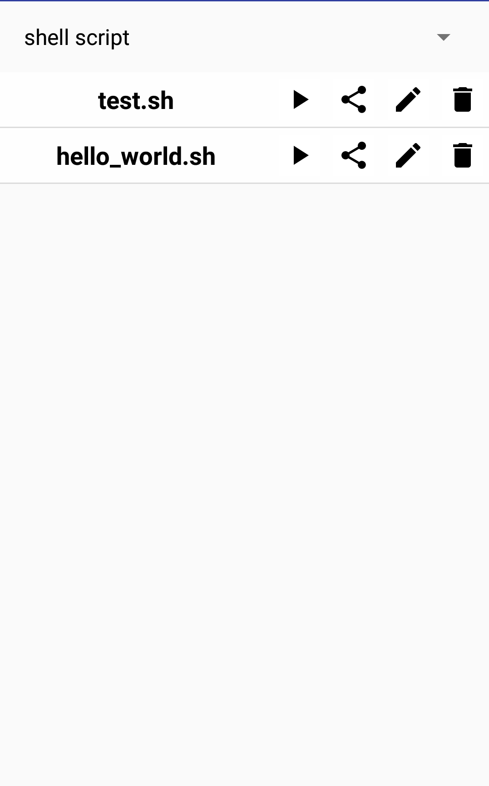
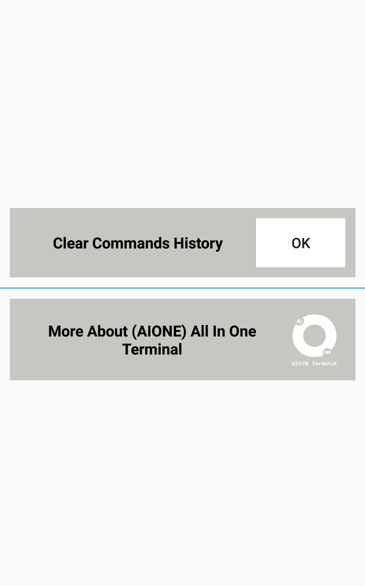
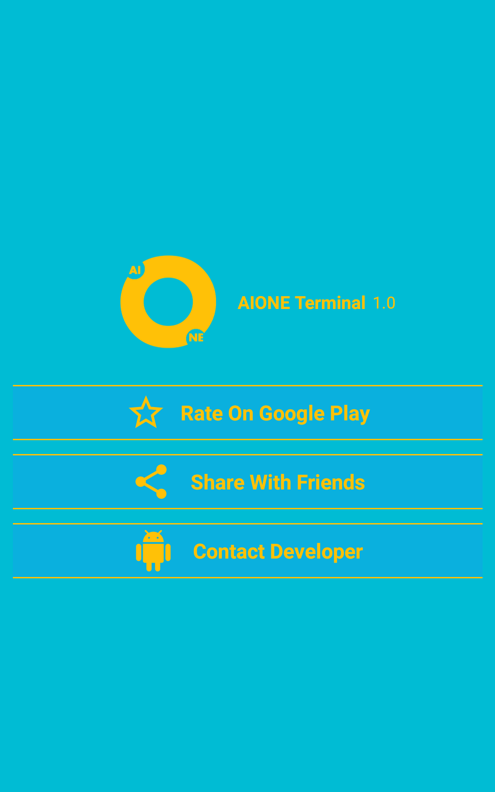

  

# [AIONE TERMINAL](https://play.google.com/store/apps/details?id=com.ma7moud3ly.aione_terminal) 
AIONE Terminal is a terminal emulator for android with a smart text editor.
- It comes with an interactive UNIX shell and a smart text editor.
- You can write,edit,execute and share scripts with other editors.
 

 

 
# [Download From Google Play](https://play.google.com/store/apps/details?id=com.ma7moud3ly.aione_terminal) 

